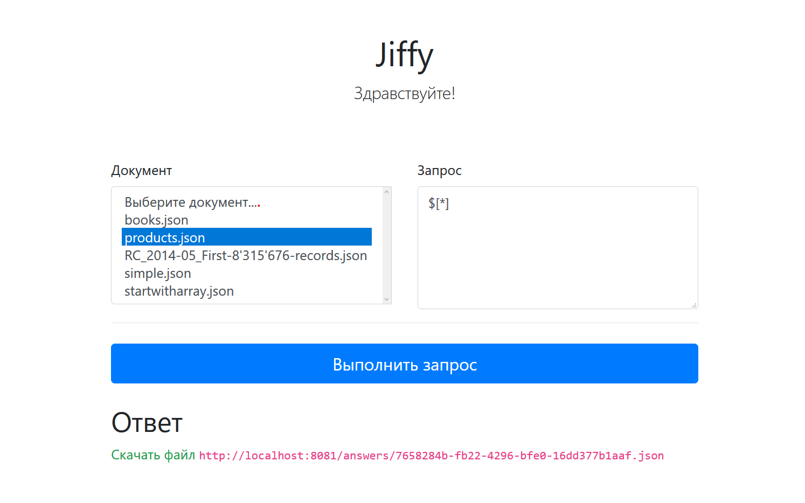

= Jiffy Web Application

A web-based user interface (UI) for the https://github.com/edubenetskiy/jiffy/tree/master/web-service[Jiffy Web Service], a tool for making queries to arbitrarily-sized JSON files.

The UI is available in two languages: Russian and English.
Choose a language in your browser’s settings to see the translated UI.

== Technology

This application is built with the https://quarkus.io[Quarkus framework], an implementation of the https://microprofile.io/[MicroProfile] specification for Java.

In order to process queries, this application uses a REST client for the Jiffy Web Service.

The UI is based on https://jakarta.ee/specifications/faces/[Jakarta Server Faces] (JSF) and https://getbootstrap.com/[Bootstrap 4].

== Modules

* `configuration` -- main executable JAR file; includes HTML pages, JSF backing beans, and deployment descriptors.
* `rest-client` -- a REST client for the Jiffy Web Service.

== Build

----
mvn clean verify
----

== Run

To run the application, you might probably need to adjust the following system property:

* `jiffy.service.url` — a base URL for the Jiffy REST service.
Default value: http://localhost:8081.

=== Run in Development mode with Live Coding

----
cd configuration/
mvn compile quarkus:dev -Ddebug=5005 -Dquarkus.http.port=8080 \
    -Djiffy.service.url=http://<hostname>:<port>
----

=== Run in Production mode

----
java -Djiffy.service.url=http://<hostname>:<port> \
    -jar configuration/target/jiffy-web-ui-runner.jar
----

== Usage

Visit http://localhost:8080.
